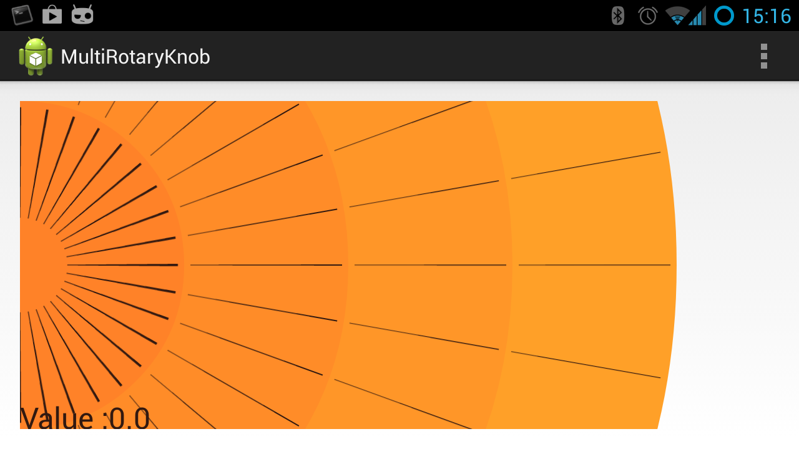
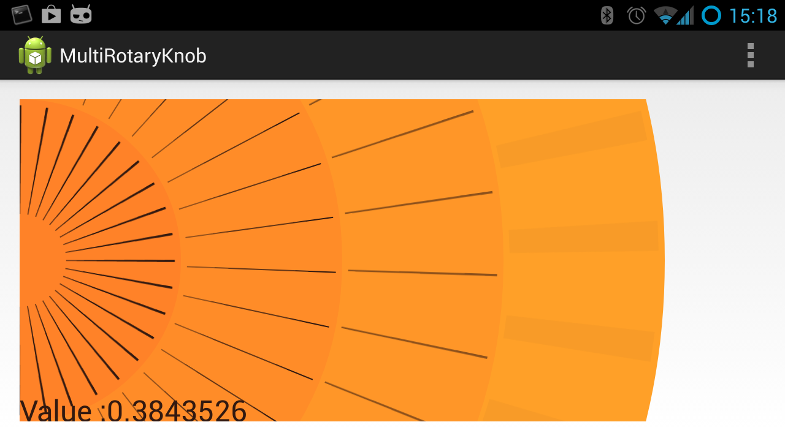

#Microscope Knob

##Description

Microscope Knob is and Android view that imitates the knobs commonly found on
microscopes.  This knob lets the user manipulate a numeric value at various
precisions.  The knobs are circular and concentric.  The innermost knob is
operates the highest power, while the outermost knob is the most precise.

##Copyright

(c) Slobodan Pejic (slobo@pejici.net) 2013.

You may use the source code under the GNU General Public License.  See
[LICENCE.txt](LICENCE.txt) for a copy of the licence.

If you wish to use the source code under different terms, please contact
Slobodan Pejic via email to slobo@pejici.net.

